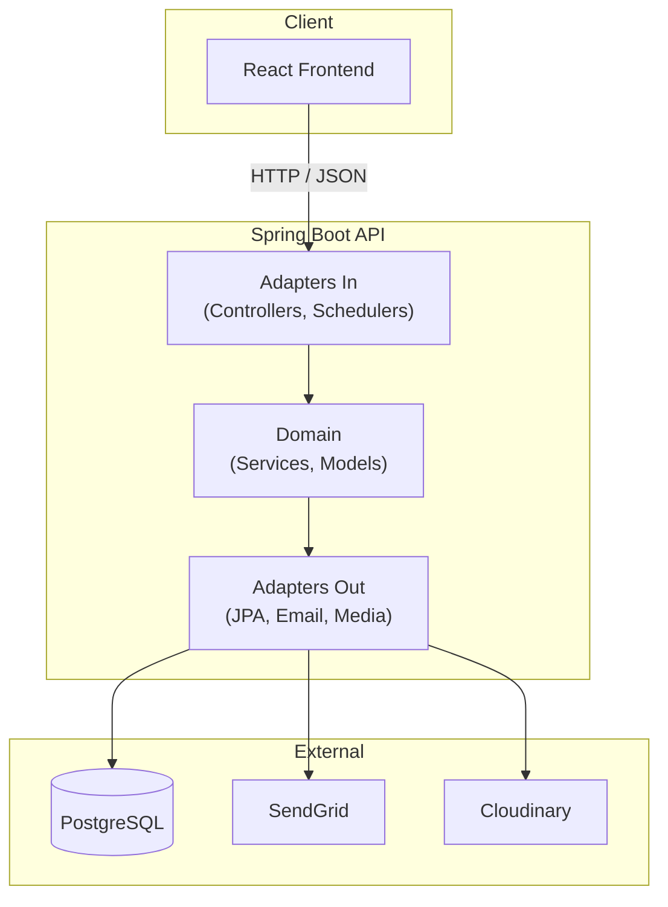
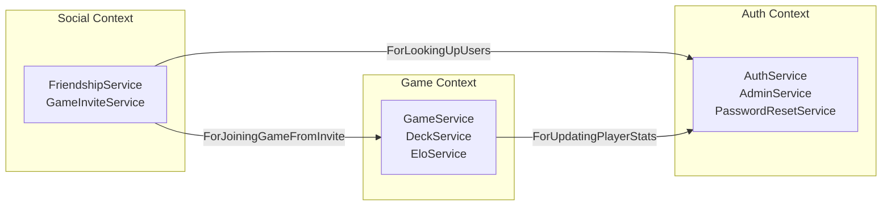
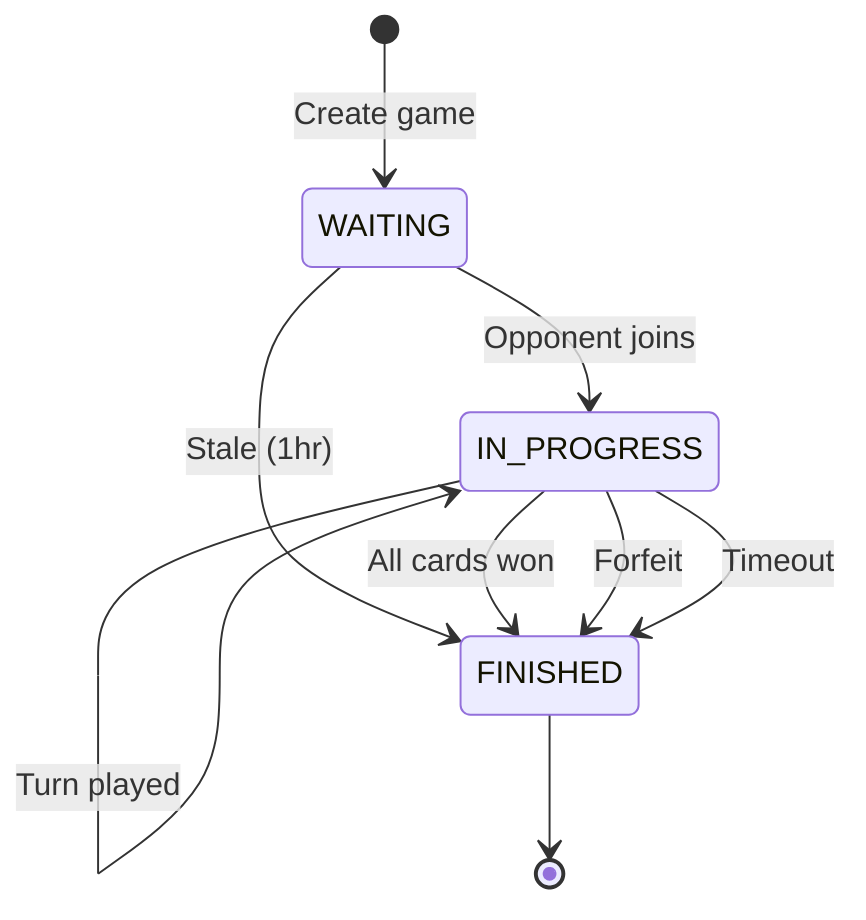
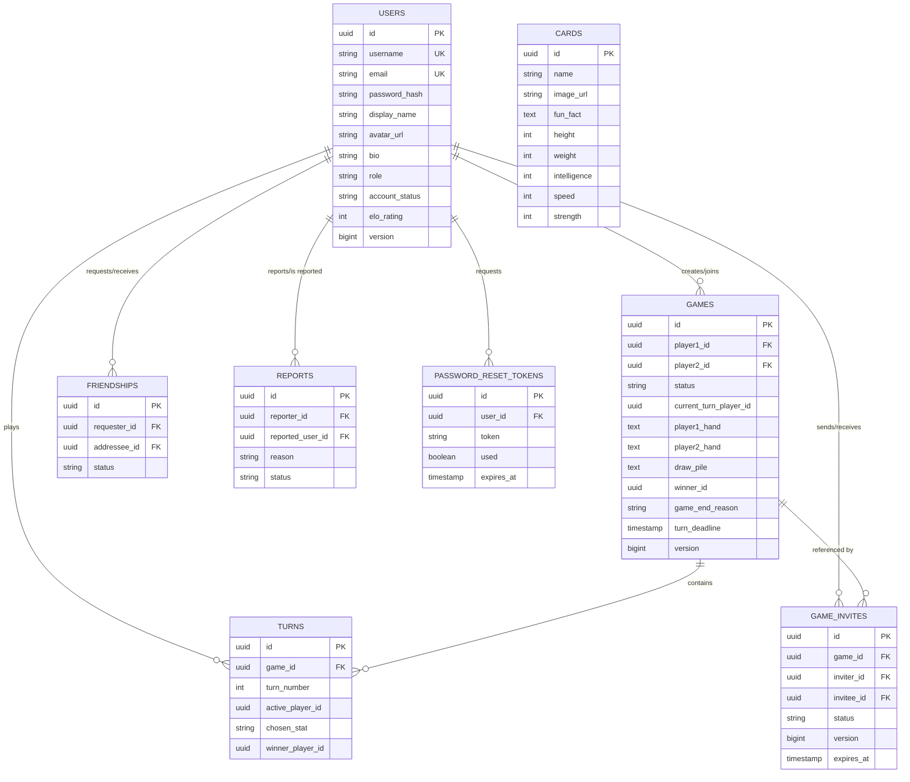

# Dino Top Trumps API

REST API for an online multiplayer dinosaur card game with league point ranking, social features, and an admin panel.

**Live API:** https://dino-top-trumps-api.onrender.com
**Swagger UI:** https://dino-top-trumps-api.onrender.com/swagger-ui/index.html
**Frontend:** https://dino-top-trumps-ui.onrender.com

> **Note for assessors:** Render free tier cold starts the JVM on first request (~2 minutes). Hit the API URL once and wait for a response before testing. The Swagger UI is the easiest way to explore all endpoints interactively. Seed test accounts exist (created by Flyway V11), and registration is open if you'd prefer to create your own. The admin panel and its features are demonstrated in the video recording.

---

## About This Project

I chose to build a card game because I wanted something that would stand out from the typical task managers and booking systems, and I'm genuinely into dinosaurs at the moment, so combining that with a competitive multiplayer game kept me motivated throughout the project.

I went with **Spring Boot** over Django because I work with Java and Spring daily in my role, and I wanted to apply patterns I'm learning at work, particularly hexagonal architecture. I use hexagonal in my current team, so the comfort level was there, and the pattern makes real sense for a game like this: the core game logic (Top Trumps rules, ELO calculations, deck shuffling) is completely decoupled from the web framework. You could lift out the domain layer and use it with a different delivery mechanism without changing a line of game code. You could also swap the dinosaur cards for any other Top Trumps deck and the game engine wouldn't care.

The application is split into three bounded contexts (`auth`, `game`, `social`), each with their own domain models, services, ports, and adapters. The domain layer is pure Java with zero Spring annotations, so services and models are testable without a Spring context.

This README covers everything you'd need to set up, understand, and evaluate the codebase. The [Table of Contents](#table-of-contents) below links to each section, and the [Swagger UI](https://dino-top-trumps-api.onrender.com/swagger-ui/index.html) provides interactive API documentation generated directly from the controllers.

---

## Table of Contents

- [Architecture Overview](#architecture-overview)
- [Bounded Contexts](#bounded-contexts)
- [Package Structure](#package-structure)
- [Tech Stack](#tech-stack)
- [Getting Started](#getting-started)
- [API Endpoints](#api-endpoints)
- [Authentication and Security](#authentication-and-security)
- [Game Logic](#game-logic)
- [Data Model](#data-model)
- [Testing Strategy](#testing-strategy)
- [Deployment](#deployment)
- [External Services](#external-services)
- [Known Limitations and Future Improvements](#known-limitations-and-future-improvements)

---

## Architecture Overview

I followed a **hexagonal architecture** (ports and adapters) pattern because it enforces a clean separation between business logic and infrastructure. The key benefit for this project is that the game rules live in pure Java. If I ever wanted to change the database, swap the email provider, or use a different web framework, the domain wouldn't need to change.



**Key decisions I made:**

- **Domain purity:** Domain services and models have zero Spring/Jakarta annotations. This means I can unit test them without booting a Spring context.
- **Port naming:** All ports follow a `ForDoingSomething` convention (e.g., `ForCreatingGame`, `ForPersistingUsers`). I picked this up from a codebase at work and it makes dependency injection self-documenting. You can read the constructor and immediately understand what the service depends on.
- **Static mappers:** I used static utility classes for domain-to-entity mapping rather than MapStruct. More boilerplate, but completely explicit and easy to debug.
- **Config-as-wiring:** Each bounded context has a single `@Configuration` class (`AuthConfig`, `GameConfig`, `SocialConfig`) that wires port implementations to domain services. This is the only place Spring reaches into the domain.

**Scalability considerations:** The architecture is designed to scale horizontally if needed. JWT authentication is stateless (no server-side sessions), so any instance can handle any request. The bounded contexts are separated by ports, which means they could be extracted into independent services with their own databases. External services (SendGrid, Cloudinary) are accessed through port abstractions, so swapping providers or adding load balancing at that layer doesn't touch the domain.

---

## Bounded Contexts

I split the application into three bounded contexts. They communicate through port interfaces, and the domain layer of one context never imports from another.



The social context defines its own outbound ports (`ForLookingUpUsers`, `ForJoiningGameFromInvite`, `ForCheckingGameStatus`) with adapter classes that bridge to the other contexts. For example, when a player accepts a game invite, the social domain calls `ForJoiningGameFromInvite` and it doesn't know or care how the game context deals cards or assigns turns. In a microservices setup, these adapters would become HTTP clients instead of in-process calls.

---

<details>
<summary><strong>Package Structure</strong> (click to expand)</summary>

```
com.dinotoptrumps/
  auth/
    adapters/in/          REST controllers, DTOs, JWT provider
    adapters/out/         JPA entities, repos, mappers, email + media adapters
    domain/model/         User, Role, AccountStatus, RankTier, Report, PasswordResetToken
    domain/service/       AuthService, AdminService, PasswordResetService, ProfanityFilter
    domain/exception/     InvalidCredentialsException, UserNotFoundException, etc.
    ports/in/             ForAuthenticating, ForRegistering, ForManagingProfile, etc.
    ports/out/            ForPersistingUsers, ForSendingEmails, ForStoringMedia, etc.
    infrastructure/spring/ AuthConfig (bean wiring)
  game/
    adapters/in/          GameController, CardController, LeaderboardController, schedulers
    adapters/out/         Game/Card/Turn JPA entities, mappers, PlayerStatsAdapter
    domain/model/         Game, Card, Hand, Turn, Stat, GameStatus, GameEndReason
    domain/service/       GameService, DeckService, StatComparisonService, EloService
    domain/exception/     GameNotFoundException, NotYourTurnException, etc.
    ports/in/             ForCreatingGame, ForPlayingTurn, ForJoiningGame, etc. (8 ports)
    ports/out/            ForPersistingGames, ForLoadingCards, ForUpdatingPlayerStats, etc.
    infrastructure/spring/ GameConfig (bean wiring)
  social/
    adapters/in/          FriendshipController, GameInviteController, DTOs
    adapters/out/         JPA entities, mappers, UserLookupAdapter, GameJoinAdapter
    domain/model/         Friendship, FriendshipStatus, GameInvite, GameInviteStatus
    domain/service/       FriendshipService, GameInviteService
    domain/exception/     FriendshipNotFoundException, NotFriendsException, etc.
    ports/in/             ForManagingFriendships, ForManagingGameInvites
    ports/out/            ForPersistingFriendships, ForLookingUpUsers, ForJoiningGameFromInvite
    infrastructure/spring/ SocialConfig (bean wiring)
  shared/
    exception/            GlobalExceptionHandler (RFC 7807), NotAuthorisedException, DataIntegrityException
    filter/               CorrelationIdFilter, RateLimitFilter
    security/             SecurityConfig, JwtAuthenticationFilter
```

</details>

---

## Tech Stack

| Component | Technology | Version |
|-----------|-----------|---------|
| Runtime | Java | 21 |
| Framework | Spring Boot | 3.4.3 |
| Build | Gradle (Kotlin DSL) | 8.x |
| Database | PostgreSQL | 16 |
| Migrations | Flyway | 10.x |
| Auth | Spring Security + JJWT | 0.12.6 |
| Email | SendGrid | 4.10.3 |
| Media storage | Cloudinary | 2.0.0 |
| API docs | springdoc-openapi (Swagger UI) | 2.8.6 |
| Code quality | Checkstyle (max method length: 50 lines) | 10.21.4 |
| Coverage | JaCoCo | 0.8.12 |
| Testing | JUnit 5, Mockito, H2 (PostgreSQL compat mode) | - |
| Deployment | Render (Docker) | - |

I chose PostgreSQL because the data is heavily relational: games reference two players, turns reference a game, friendships link two users with state machines, and invites expire with time-based queries. The FK constraints, transactional integrity, and support for complex queries (OR-across-columns for match history, date-range filtering for stale cleanup) made a relational database the natural fit. A document database like MongoDB would lose the referential guarantees that keep game state consistent.

---

## Getting Started

### Prerequisites

- Java 21
- Docker (for local PostgreSQL)
- Gradle wrapper included (no install needed)

### Local Setup

```bash
# Clone
git clone https://github.com/Josh-WrightADA/dino-top-trumps-api.git
cd dino-top-trumps-api

# Start PostgreSQL
docker-compose up -d db

# Run the API (dev profile)
./gradlew bootRun

# API available at http://localhost:8080
# Swagger UI at http://localhost:8080/swagger-ui.html
```

Seed test accounts are created automatically by Flyway migration V11. Registration is also open for creating new accounts.

<details>
<summary><strong>Environment Variables</strong> (click to expand)</summary>

All secrets are managed via environment variables. Nothing is committed to source control. The dev profile uses sensible defaults for local development. Production requires all variables to be set.

| Variable | Description | Required in Prod |
|----------|-------------|-----------------|
| `DB_HOST` | PostgreSQL host | Yes |
| `DB_PORT` | PostgreSQL port | Yes |
| `DB_NAME` | Database name | Yes |
| `DB_USERNAME` | Database user | Yes |
| `DB_PASSWORD` | Database password | Yes |
| `JWT_SECRET` | HMAC-SHA signing key (min 32 chars) | Yes |
| `CORS_ALLOWED_ORIGINS` | Comma-separated frontend URLs | Yes |
| `SENDGRID_API_KEY` | SendGrid API key for emails | Yes |
| `SENDGRID_FROM_EMAIL` | Sender email address | Yes |
| `FRONTEND_URL` | Frontend base URL (for reset links) | Yes |
| `CLOUDINARY_CLOUD_NAME` | Cloudinary account | Yes |
| `CLOUDINARY_API_KEY` | Cloudinary API key | Yes |
| `CLOUDINARY_API_SECRET` | Cloudinary secret | Yes |

</details>

<details>
<summary><strong>Card Data</strong> (click to expand)</summary>

The game features 36 dinosaur cards, each with curated stats, an image, and an educational fun fact.

- **Source:** Dinosaur names and taxonomy from the Zenodo World Dinosaur Dataset (CC0 licence)
- **Stats:** I manually balanced all stats on a 1-100 scale for competitive gameplay (height, weight, intelligence, speed, strength)
- **Images:** Generated and hosted on Cloudinary CDN
- **Fun facts:** Curated educational content per card (e.g., "Velociraptors were actually the size of a turkey")
- **Seeding:** Cards are seeded via Flyway migrations V6 and V9, with fun facts added in V14 and V20

</details>

---

## API Endpoints

Full interactive documentation is available at [Swagger UI](https://dino-top-trumps-api.onrender.com/swagger-ui/index.html). Below is a summary of all endpoints.

<details>
<summary><strong>Auth endpoints</strong> (<code>/api/v1/auth</code>)</summary>

| Method | Path | Description |
|--------|------|-------------|
| POST | `/register` | Register new account |
| POST | `/login` | Authenticate and receive JWT |
| GET | `/me` | Get own profile |
| PUT | `/me` | Update display name, bio, favourite card |
| POST | `/me/avatar` | Upload avatar image (multipart) |
| PUT | `/me/dino-avatar` | Set avatar from card gallery |
| PUT | `/me/password` | Change password |
| DELETE | `/me` | Delete account (requires password) |
| GET | `/players/{id}` | View public profile |
| POST | `/players/{id}/report` | Report a player |
| POST | `/forgot-password` | Request password reset email |
| POST | `/reset-password` | Reset password with token |

</details>

<details>
<summary><strong>Game endpoints</strong> (<code>/api/v1/games</code>)</summary>

| Method | Path | Description |
|--------|------|-------------|
| POST | `/` | Create new game |
| POST | `/{id}/join` | Join a waiting game |
| POST | `/{id}/turns` | Play a turn (choose stat) |
| POST | `/{id}/forfeit` | Forfeit the game |
| GET | `/{id}` | Get game state (player-specific view) |
| GET | `/available` | List games waiting for opponent |
| GET | `/active` | List own active games |
| GET | `/history` | Match history with opponent names |

</details>

<details>
<summary><strong>Social endpoints</strong> (<code>/api/v1/social</code>)</summary>

| Method | Path | Description |
|--------|------|-------------|
| POST | `/friends/request/{userId}` | Send friend request |
| POST | `/friends/{id}/accept` | Accept friend request |
| POST | `/friends/{id}/decline` | Decline friend request |
| DELETE | `/friends/{id}` | Remove friend |
| GET | `/friends` | List accepted friends |
| GET | `/friends/pending` | List pending requests |
| POST | `/invites/{gameId}/send/{userId}` | Send game invite |
| POST | `/invites/{id}/accept` | Accept game invite |
| POST | `/invites/{id}/decline` | Decline game invite |
| GET | `/invites/pending` | List pending invites |

</details>

<details>
<summary><strong>Admin endpoints</strong> (<code>/api/v1/admin</code>) (requires ADMIN role)</summary>

| Method | Path | Description |
|--------|------|-------------|
| GET | `/users` | List all users |
| POST | `/users/{id}/ban` | Ban a user |
| POST | `/users/{id}/unban` | Unban a user |
| GET | `/games` | List all games |
| DELETE | `/games/{id}` | Delete a game |
| GET | `/reports` | List all reports |
| POST | `/reports/{id}/dismiss` | Dismiss a report |

</details>

<details>
<summary><strong>Cards and Leaderboard endpoints</strong></summary>

**Cards** (`/api/v1/cards`)
| Method | Path | Description |
|--------|------|-------------|
| GET | `/` | List all 36 dinosaur cards (cached 1h) |
| GET | `/{id}` | Get card details |

**Leaderboard** (`/api/v1/leaderboard`)
| Method | Path | Description |
|--------|------|-------------|
| GET | `/` | Ranked player list with LP and tier |

</details>

---

## Authentication and Security

Security was something I spent a lot of time on, because I wanted to go beyond basic token auth and think about what an enterprise application would actually need.

### JWT Authentication
- Stateless token-based auth with 24-hour expiry
- BCrypt password hashing through the `ForEncodingPasswords` port
- Tokens contain user ID, username, and role as claims
- `JwtAuthenticationFilter` validates on every protected request

### Role-Based Access Control
- Two roles: `PLAYER` and `ADMIN`
- Role stored in JWT claims, extracted as `GrantedAuthority`
- Admin endpoints protected with `hasRole("ADMIN")` in SecurityConfig
- Banned users are blocked at login (account status checked in the domain layer)

### Anti-Cheat
I put thought into preventing client-side manipulation:
- `GameStateResponse.forPlayer()` hides the opponent's hand, so players only see their own cards
- The server determines which cards are played (always the top of the hand). The client can't choose
- Turn order is enforced server-side. Playing out of turn returns 403
- Non-participants receive 404 (not 403) to prevent game ID enumeration

### Defence in Depth
- **Rate limiting:** Sliding window on login (5/min) and registration (3/min) per IP, returning RFC 7807 `429 Too Many Requests`
- **Security headers:** `X-Content-Type-Options: nosniff`, `X-Frame-Options: DENY`, `Strict-Transport-Security` with 1-year max-age
- **Input validation:** `@Valid` on all request DTOs with structured field-level error messages
- **Profanity filter:** Validates display names and bios against a configurable word list at the domain layer
- **Correlation IDs:** Every request gets a UUID via MDC, returned in the `X-Correlation-ID` response header for tracing
- **Audit logging:** Structured `event_type` field on 12 security events (login success/fail/banned, password changes, account deletion, bans, reports)
- **Account deletion:** Requires password confirmation. The backend validates independently of the frontend

<details>
<summary><strong>Password Reset Flow</strong> (click to expand)</summary>

1. User requests reset via `POST /forgot-password` with their email
2. Server generates a UUID token with 1-hour expiry, sends it via SendGrid
3. The response always says "if that email exists" regardless. This prevents email enumeration
4. User clicks the link in the email containing the token
5. `POST /reset-password` validates the token (exists, not expired, not already used), updates the password, and marks the token as used
6. Token is single-use, so resubmitting the same link returns an error

</details>

<details>
<summary><strong>File Upload Protection</strong> (click to expand)</summary>

Users can upload avatar images via the profile page. The upload flow has multiple protection layers:
- **Authentication required:** Only logged-in users can upload, and only to their own profile
- **File type validation:** Only JPEG, PNG, and WebP are accepted. Other file types are rejected with a 400 error
- **File size limit:** Maximum 2MB per upload
- **External storage:** Files are sent directly to Cloudinary via the `ForStoringMedia` port, not stored on the application server. This means the API server never holds user files on disk, reducing attack surface
- **No direct file serving:** The API returns a Cloudinary URL. The frontend loads images from Cloudinary's CDN, not from the API server

</details>

<details>
<summary><strong>Error Responses (RFC 7807)</strong> (click to expand)</summary>

All errors return [RFC 7807 Problem Details](https://www.rfc-editor.org/rfc/rfc7807) with `type`, `title`, `status`, and `detail` fields. I mapped each domain exception to a specific HTTP status:

| Exception | Status | When |
|-----------|--------|------|
| `InvalidCredentialsException` | 401 | Wrong username/password, banned account |
| `UserNotFoundException` | 404 | User/profile not found |
| `NotAuthorisedException` | 403 | Acting on another user's resources |
| `GameNotFoundException` | 404 | Game doesn't exist or player not a participant |
| `NotYourTurnException` | 403 | Playing out of turn |
| `InvalidGameStateException` | 400 | Invalid state transition |
| `GameInviteExpiredException` | 410 | Invite past 5-minute expiry |
| `ObjectOptimisticLockingFailureException` | 409 | Concurrent modification detected |

</details>

---

## Game Logic

### Rich Domain Model
This is the part I'm most proud of. The `Game` class owns its business rules. It's not a data bag with getters and setters. `GameService` is a thin orchestrator that delegates to the domain.

```java
// The domain model owns the rules
game.start(joiningPlayer, dealtHands);     // deals cards, starts timer
game.resolveRound(winningCardId, p1, p2);  // draw pile, card transfer
game.checkGameOver();                       // winner detection
game.forfeit(winnerId, reason);             // forfeit transition
```

Domain models use **behaviour methods instead of setters**: `User.changeDisplayName()`, `Game.resolveRound()`, `Friendship.accept()`. These express intent and enforce invariants, and the domain protects its own state. Construction uses static factory methods (`Game.create()`, `User.create()`) and getters return unmodifiable collections to prevent external mutation.

### Game Flow



### Top Trumps Rules
- Each player is dealt half the deck (36 cards, shuffled with Fisher-Yates)
- The active player chooses a stat (height, weight, intelligence, speed, strength)
- Higher value wins both cards, and the winner keeps their turn
- **On draw:** both cards go to the draw pile. The next winner takes all accumulated cards.
- The game ends when one player holds all cards

### Turn Timer and Cleanup
- 30-second deadline per turn, enforced server-side
- The frontend renders the server's `turnDeadline` timestamp, so it can't be manipulated client-side
- A scheduled task runs every 10 minutes to clean up abandoned games (WAITING > 1hr, timed-out IN_PROGRESS)
- The scheduler is an inbound adapter that calls the same `ForCleaningUpGames` port that a REST controller would

### ELO Rating System
- Hidden from users. They see League Points (LP) and tier instead
- Dynamic K-factor: 64 (first 10 games), 48 (10-30 games), 32 (30+ games) so new players climb faster, similar to how competitive games like Valorant handle placement matches
- LP is derived from ELO on read via `RankTier.calculateLeaguePoints()`, with no duplicate data in the database
- Rating floor of 100 prevents negative ELO
- 5 tiers: Hatchling, Herbivore, Carnivore, Apex, Meteor

<details>
<summary><strong>Social Features</strong> (click to expand)</summary>

**Friendships** follow a state machine: `PENDING` -> `ACCEPTED` / `DECLINED`, `ACCEPTED` -> `REMOVED`. The domain model enforces valid transitions. Accepting a non-pending friendship throws `IllegalStateException`. Bi-directional duplicate checks prevent both users from sending requests to each other simultaneously.

**Game invites** have a 5-minute expiry enforced by the domain model. The cleanup scheduler removes expired invites automatically. Accepting an invite triggers a cross-context call through `ForJoiningGameFromInvite`, which bridges to the game context's join flow.

**User reports** follow a `PENDING` -> `DISMISSED` lifecycle. Players report via the public profile, admins review and dismiss via the admin panel.

</details>

<details>
<summary><strong>Concurrency Safety</strong> (click to expand)</summary>

- `@Version` optimistic locking on Game, User, and GameInvite entities prevents concurrent modification
- Two simultaneous turn submissions get a 409 Conflict instead of silently corrupting data
- `@Transactional` on all multi-entity write operations (turn + stats, forfeit + stats, invite accept + game join)
- I placed transaction annotations on adapter-layer methods (controllers, persistence adapters) rather than domain services, to keep the domain free of Spring annotations

</details>

---

## Data Model

<details>
<summary><strong>Full ER Diagram</strong> (click to expand)</summary>



</details>

**Design decisions I made:**
- **Hand storage:** I store hands as comma-separated UUIDs in TEXT columns, with serialisation in the mapper layer. A normalised join table would be more relational, but adds complexity for what's essentially an ordered list.
- **FK cascade strategy:** When a user deletes their account, their games cascade-delete, but opponent references (`player2_id`, `winner_id`) use SET NULL to preserve match history. I caught this issue during user testing. The original hard cascades were breaking opponent game history.
- **ELO on users table:** In a microservices setup, player stats would live in their own table in the game context. In this monolith, co-locating with users is pragmatic.

<details>
<summary><strong>Database Migrations</strong> (24 Flyway migrations, click to expand)</summary>

These are the source of truth, and I never modified the database manually.

| Migration | Description |
|-----------|-------------|
| V1 | Create users table |
| V2 | Create password reset tokens |
| V3 | Create cards table |
| V4 | Create games table |
| V5 | Create turns table |
| V6 | Seed 36 dinosaur cards |
| V7 | Add draw pile column to games |
| V8 | Add card description field |
| V9 | Update cards with images and descriptions |
| V10 | Add avatar URL to users |
| V11 | Seed test accounts |
| V12 | Add performance indexes |
| V13 | Add user profile fields (bio, favourite dinosaur) |
| V14 | Add educational fun facts to cards |
| V15 | Add role and account status to users |
| V16 | Create reports table |
| V17 | Create friendships table |
| V18 | Create game invites table |
| V19 | Fix user delete cascade strategy |
| V20 | Add missing fun facts for 6 cards |
| V21 | Add game end reason field |
| V22 | Add version column to games (optimistic locking) |
| V23 | Add version column to users (optimistic locking) |
| V24 | Add version column to game invites (optimistic locking) |

</details>

---

## Testing Strategy

**177 tests** covering domain logic, services, mappers, and full HTTP integration.

- **Unit tests:** Domain models (`Hand`, `EloService`, `StatComparison`, `RankTier`), services with mocked ports, mapper boundary tests
- **Integration tests:** Full HTTP chain with `@SpringBootTest`, shared `IntegrationTestBase` and `TestFixtures`, `@Transactional` for test isolation
- **Database:** H2 in-memory with PostgreSQL compatibility mode (`MODE=PostgreSQL`) and a `TIMESTAMPTZ` domain alias
- **Coverage:** JaCoCo reports **77% overall, 96% game domain services**
- **Code quality:** Checkstyle enforces naming conventions, no star imports, no empty blocks, braces required, **max method length 50 lines**
- **Run:** `./gradlew clean test` then `./gradlew test jacocoTestReport` for coverage HTML

### User Testing
Beyond automated tests, I ran systematic user testing on the live Render deployment:
- **Developer regression test:** 340+ test cases across 19 categories covering auth flows, game mechanics, social features, admin panel, design consistency, and error handling
- **External user test:** A simplified test script distributed to friends for real-user feedback on registration, gameplay, and social features
- **Bugs caught through testing:** FK cascade failures on account deletion, profanity filter false positives on substrings, missing fun facts for 6 cards, incorrect password change error codes, LP display inconsistencies, all caught live and fixed iteratively

---

## Deployment

**Platform:** Render free tier (Docker-based). Both frontend and backend are deployed and auto-deploy from `main` on every merge.

- **Docker:** Multi-stage build: JDK for compilation, JRE Alpine for runtime. Gradle dependencies are cached in a separate layer so rebuilds only recompile application code.
- **Health checks:** Liveness at `/actuator/health/liveness`, readiness at `/actuator/health/readiness`, Docker HEALTHCHECK every 30s. Grace period set to 900s for JVM startup.
- **Graceful shutdown:** 30-second timeout so in-flight requests complete during deployment
- **Response compression:** gzip enabled at 1KB threshold
- **HTTP caching:** `Cache-Control: max-age=3600, public` on the cards endpoint because card data is static and seeded via Flyway
- **CORS:** Configurable via `CORS_ALLOWED_ORIGINS` env var
- **Eager bean initialisation.** I deliberately avoided lazy init because it hides configuration errors. Eager loading surfaces problems at deploy time, not when a user hits the endpoint.
- **Structured logging:** Logback configured with correlation ID pattern (`%X{correlationId}`) and structured `event_type` fields for security events
- **Render free-tier PostgreSQL** has a 90-day expiry, so the database will remain active well beyond the marking window

<details>
<summary><strong>CI/CD Pipeline</strong> (click to expand)</summary>

GitHub Actions runs on every push to `main` and every pull request:

1. Checkout code
2. Setup Java 21 (Temurin) with Gradle cache
3. Build (compile only)
4. Run tests with JaCoCo coverage
5. Run Checkstyle (main + test)
6. Upload coverage report as artifact
7. Upload Checkstyle report as artifact

</details>

---

## External Services

| Service | Purpose | How It Integrates |
|---------|---------|-------------------|
| **SendGrid** | Password reset emails | `ForSendingEmails` port -> `EmailAdapter`. Swapping to a different email provider means changing one adapter class. |
| **Cloudinary** | Card image CDN (36 static images) + user avatar uploads | `ForStoringMedia` port -> `CloudinaryAdapter`. Two use cases behind one port. |
| **PostgreSQL** | Persistent data storage | Managed by Render, connected via environment variables. |

Because everything goes through port interfaces, the external service choices aren't permanent. SendGrid could be replaced with AWS SES or Mailgun by writing a new adapter. Cloudinary could be swapped for AWS S3 or Firebase Storage. PostgreSQL could be switched to MySQL or another relational database since I'm using standard JPA without PostgreSQL-specific features beyond the Flyway migrations. The domain layer wouldn't change for any of these.

---

## Known Limitations and Future Improvements

These are trade-offs I'm aware of, not oversights, and in each case I've noted what a production system would do differently.

| What | Current Approach | What I'd Do in Production |
|------|-----------------|--------------------------|
| **N+1 on game lists** | `getAvailableGames()` and `getMatchHistory()` look up each player's display name individually | Batch lookup with `IN` query or denormalise display names |
| **Service size** | `AuthService` implements 4 ports, `GameService` implements 8 | Split into focused services (e.g., `RegistrationService`, `GamePlayService`) |
| **Cross-context imports** | Some adapter classes import domain models from other contexts | In microservices, these become API calls |
| **Rate limiting** | In-memory `ConcurrentHashMap`, which works for single instance | Redis or Bucket4j for distributed deployments |
| **Profanity filter** | Regex against a file-based word list | External moderation API (AWS Comprehend, Google Perspective) |
| **Pagination** | Client-side only, with all results returned | Spring Data `Pageable` for server-side pagination |
| **LP delta** | API returns final LP but not the gain/loss amount | Compute and include `lpDelta` in the response |
| **Coin flip** | `Math.random()`, which is not deterministic for testing | Inject a `Random` instance |
| **Deletes** | Hard deletes with FK cascades and SET NULL | Soft deletes with `deleted_at` for full audit trail |
| **Resilience** | No circuit breakers on external service calls (SendGrid, Cloudinary). If Cloudinary is down, avatar upload fails with a 500 | resilience4j circuit breaker pattern with fallback responses |
| **Redundancy** | Single instance on Render free tier. No horizontal scaling or failover | Multiple instances behind a load balancer. The architecture supports this since JWT is stateless and there are no server-side sessions |
